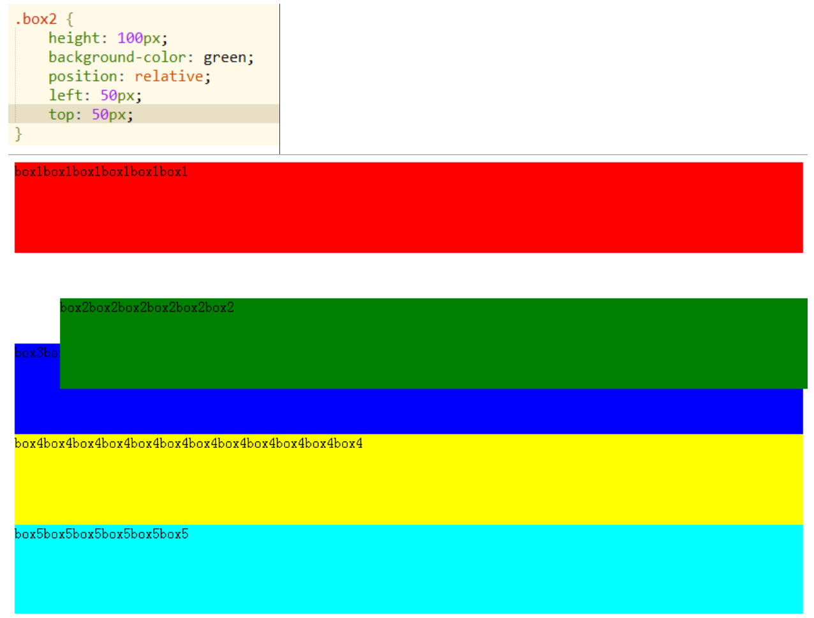
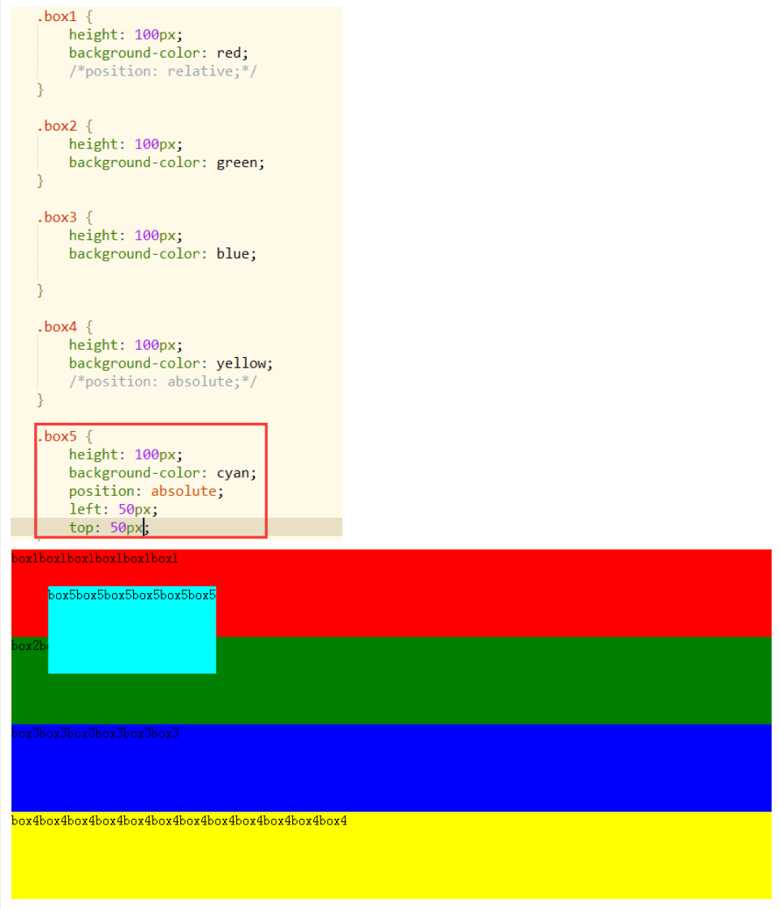

# web-examples

### Introductions

基础网页开发技术，为前端开发技术提供支撑。  
熟悉 Markdown 文档语法。  
熟悉 git/github。

### Development Environments

- VS Code
- Prettier
- Git

## Update

#### 2024.09.04 17:17

实现了 git 的操作（拉取、推送等），VSCode 的配置。

#### 2024.09.05 12:00

Learend how to maintaining remote repositories by git.

#### 2024.09.06 8:37

Finished homework1,solidify CSS's knowledge.

## Gains

### Knows how to use git to Maintaining remote repositories.

#### such like:

**_git init_** : The local repositroies's init. 
**_git add_** : You can add the doucument to local temporary space.
 
**_git comit_** :Name your version's name,add into local repositroies(.git)
 
**_git push_** :Push your local version to remote repositroies.
 
**_git pull_** :Pull the remote version to your local repositroies.
 
**_git clone_** :Copy whole remote repositroies to your local repositroies.
 
**_git log&relog_** :Query the version's information.
 
**_git reset --hard_** :Make your local repositroies change to a version.
 

### How to understand the branch,upstream?

The remote repositroies but isn't your remote repositroies.Such like if i want to push the commite on BO's remote repositroies,his is upstream for me.And this way maybe appear the remote and local inconsistencies,so BO needs to pull the remote to renew his local repositrioies.

### Homework 1

#### 1.Position:relative\absolute

You can understand by these pictures.

#### 2.focus\valid\hover

#### 3.Combinators Selectors

<pre>
 >： 直接子选择器。
（空格）： 后代选择器。
+： 紧邻兄弟选择器。
~： 通用兄弟选择器。
</pre>
